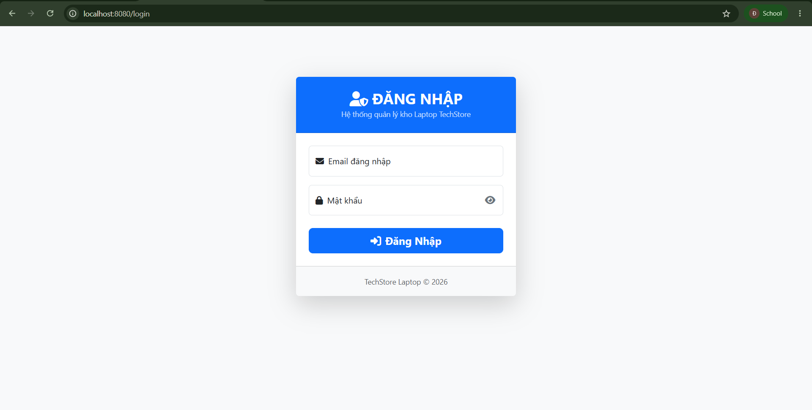
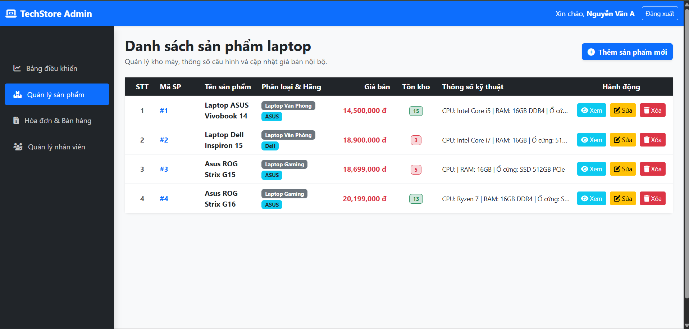
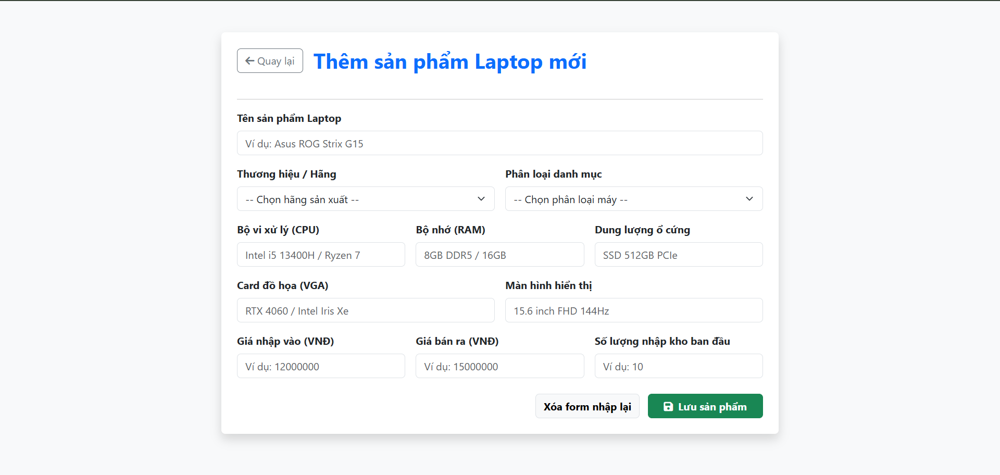
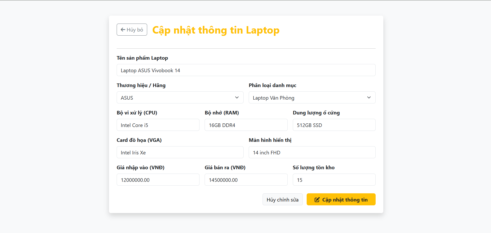
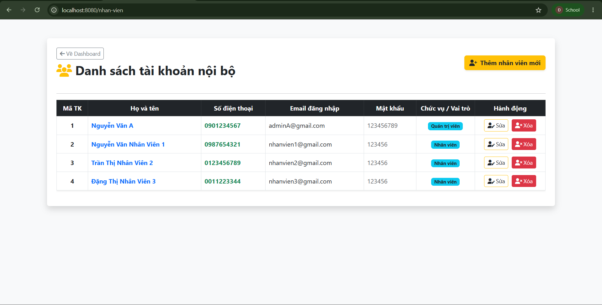

# 💻 Website Quản Lý Nội Bộ Cửa Hàng Laptop (TechStore)
## Link demo dự án :
[](https://drive.google.com/file/d/1DvRrO9rTW32hcVg4-xMwk8b6e-aNbnkl/view?usp=sharing)
## 1. Mô tả ứng dụng
**TechStore Admin** là hệ thống phần mềm quản trị nội bộ được thiết kế chuyên biệt dành cho các cửa hàng kinh doanh máy tính/laptop. Ứng dụng giúp chủ cửa hàng và nhân viên dễ dàng quản lý kho hàng, theo dõi chi tiết cấu hình thông số kỹ thuật của từng mẫu laptop, kiểm soát giá bán - giá nhập, và đặc biệt là hệ thống phân quyền quản lý tài khoản nhân viên chặt chẽ, bảo mật.

---

## 2. Công nghệ sử dụng
Dự án được phát triển dựa trên nền tảng Java Full-Stack kết hợp các công nghệ hiện đại nhất:
* **Backend:** Java 21, Spring Boot 4.0.6.
* **Database:** MySQL / Spring Data JPA (Quản lý thực thể và truy vấn cơ sở dữ liệu).
* **Frontend:** HTML5, CSS3, Thymeleaf (View Engine của Spring), Bootstrap 5 (Responsive UI), FontAwesome 6 (Icons).
* **Quản lý phiên (Session):** Tích hợp phân quyền bảo mật qua `HttpSession`.

---

## 3. Các chức năng chính
Hệ thống được chia làm 2 vai trò cốt lõi với quyền hạn khác biệt:

* **🔐 Phân quyền Hệ thống:**
    * `Quản trị viên (Admin)`: Nắm toàn quyền hệ thống. Được phép thao tác Thêm/Sửa/Xóa mọi dữ liệu, và quản lý cấp phát tài khoản cho nhân viên.
    * `Nhân viên (Employee)`: Chỉ được phép xem danh sách, Thêm mới và Sửa thông tin sản phẩm (Nút "Xóa" bị khóa hoàn toàn). Không có quyền truy cập vào khu vực quản lý nhân sự.

* **📦 Quản lý Sản phẩm & Kho (Product Management):**
    * Thêm, sửa, xóa sản phẩm laptop với bộ thông số kỹ thuật chi tiết (CPU, RAM, Ổ cứng, VGA, Màn hình...).
    * Quản lý số lượng tồn kho, giá nhập vào và giá bán ra.
    * Xem chi tiết sản phẩm với giao diện thẻ trực quan.

* **👥 Quản lý Nhân sự (Employee Management - Only Admin):**
    * Thêm mới tài khoản nhân viên vào hệ thống (tự động kích hoạt trạng thái).
    * Cập nhật thông tin (Họ tên, SĐT, Email đăng nhập, Mật khẩu, Chức vụ).
    * Xóa tài khoản khi nhân viên nghỉ việc.

---

## 4. Hình ảnh giao diện hệ thống

* **Trang Đăng nhập bảo mật:**
    
* **Trang Bảng điều khiển (Dashboard):**
    
* **Quản lý danh sách Laptop:**
    
* **Form Cập nhật / Thêm sản phẩm:**
    
    
* **Quản lý danh sách Nhân viên nội bộ:**
    

---

## 5. Sơ đồ kiến trúc hệ thống
Dự án được thiết kế theo chuẩn mô hình **MVC (Model-View-Controller)** kết hợp kiến trúc đa tầng (Controller - Service - Repository) giúp code sạch, dễ bảo trì và dễ dàng mở rộng.

```text
       +-------------------------------------------------------+
       |               Trình duyệt / Nhân viên                 |
       +------------------------------------------+------------+
                                                  |
                                    HTTP Request  |  HTTP Response
                                    (Form, Files) |  (HTML, Thymeleaf)
                                                  v
       +-------------------------------------------------------+
       |             TẦNG ĐIỀU HƯỚNG (CONTROLLER LAYER)        |
       |  - AccountController    - SanPhamController           |
       |  - NhanVienController   - DashboardController         |
       |  (Kiểm tra Session Role: Admin/Nhân viên)             |
       +------------------------------------------+------------+
                                                  |
                                    Data/Entities | 
                                                  v
       +-------------------------------------------------------+
       |              TẦNG NGHIỆP VỤ (SERVICE LAYER)           |
       |  - TaiKhoanService (Xử lý Đăng nhập, Check Auth)      |
       +------------------------------------------+------------+
                                                  |
                                                  v
       +-------------------------------------------------------+
       |             TẦNG TRUY CẬP DỮ LIỆU (REPOSITORY LAYER)  |
       |  - Spring Data JPA Interfaces                         |
       |  - SanPhamRepository, TaiKhoanRepository, vv...       |
       +------------------------------------------+------------+
                                                  |
                                     SQL Queries  | JDBC Results
                                                  v
       +-------------------------------------------------------+
       |                 CƠ SỞ DỮ LIỆU (DATABASE)              |
       |  - MySQL Server (Lưu trữ Sản phẩm, Tài khoản,...)     |
       +-------------------------------------------------------+
```
---
##6. Cấu trúc chi tiết thư mục dự án
```text
src/main/
├── java/k65cntt/nguyentandat/WebsiteQuanLyNoiBoCuaHangLaptop/
│   ├── WebsiteQuanLyNoiBoCuaHangLaptopApplication.java  # File chạy ứng dụng
│   │
│   ├── Controller/                  # Điều hướng & Xử lý Request
│   │   ├── AccountController.java   # Xử lý Login, Logout, Dashboard
│   │   ├── SanPhamController.java   # Quản lý Sản phẩm (CRUD, Upload ảnh)
│   │   └── NhanVienController.java  # Quản lý tài khoản (Chỉ Admin)
│   │
│   ├── Entity/                      # Ánh xạ các bảng trong CSDL
│   │   ├── TaiKhoan.java            # Bảng taikhoan
│   │   ├── SanPham.java             # Bảng sanpham
│   │   ├── ThuongHieu.java          # Bảng thuonghieu
│   │   └── DanhMuc.java             # Bảng danhmuc
│   │
│   ├── Repository/                  # Tương tác với cơ sở dữ liệu MySQL
│   │   ├── TaiKhoanRepository.java
│   │   └── SanPhamRepository.java
│   │
│   └── Service/                     # Chứa logic nghiệp vụ
│       └── TaiKhoanService.java     
│
└── resources/
    ├── application.properties       # Cấu hình Database, cổng kết nối, file upload
    ├── static/                      
    │   └── images/                  # Thư mục chứa hình ảnh sản phẩm tải lên
    └── templates/                   # Giao diện HTML (Thymeleaf)
        ├── login.html               
        ├── dashboard.html           
        ├── sanpham.html             # Danh sách sản phẩm
        ├── them-sanpham.html        # Form thêm mới
        ├── sua-sanpham.html         # Form cập nhật
        ├── chi-tiet-sanpham.html    # Xem chi tiết cấu hình máy
        ├── nhan-vien.html           # Danh sách nhân viên (Bố cục chuẩn)
        ├── them-nhanvien.html       
        └── sua-nhanvien.html
```
## 🚀 7. Hướng dẫn cài đặt và chạy dự án

### 🛠️ Yêu cầu môi trường
* **JDK:** Phiên bản 17 hoặc 21.
* **Database:** MySQL Server (Workbench, XAMPP, hoặc dBeaver).
* **IDE:** Eclipse, IntelliJ IDEA, hoặc Spring Tool Suite (STS).

### 🗄️ Bước 1: Cấu hình cơ sở dữ liệu
1. Mở MySQL (thông qua phpMyAdmin của XAMPP hoặc MySQL Workbench).
2. Tạo Database mới (Ví dụ: `quanly_laptop_db`).
3. Mở file `src/main/resources/application.properties` và sửa lại thông tin kết nối cho phù hợp với máy của bạn:

```properties
spring.datasource.url=jdbc:mysql://localhost:3306/TÊN_DATABASE_CỦA_BẠN?useSSL=false&serverTimezone=UTC
spring.datasource.username=root
spring.datasource.password=MẬT_KHẨU_CỦA_BẠN
# Tự động tạo bảng dựa trên Entity
spring.jpa.hibernate.ddl-auto=update
```
### 💻 Bước 2: Khởi chạy dự án

**Nếu dùng Spring Tool Suite (STS) / Eclipse:**
1. Mở IDE, chọn **File** -> **Import...** -> **Existing Maven Projects** (Hoặc Gradle tùy dự án của bạn).
2. Trỏ đến thư mục chứa dự án.
3. Chuột phải vào file `WebsiteQuanLyNoiBoCuaHangLaptopApplication.java` -> Chọn **Run As** -> **Spring Boot App** (hoặc **Java Application**).

### 🌐 Bước 3: Trải nghiệm hệ thống

* Mở trình duyệt và truy cập đường dẫn: `http://localhost:8080`
* Hệ thống sẽ tự động chuyển hướng về trang đăng nhập `/login`.

> **Lưu ý:** Bạn cần tạo sẵn 1 tài khoản có `vaiTro` là `Quản trị viên` trong database thông qua công cụ MySQL để có thể đăng nhập lần đầu và trải nghiệm toàn quyền hệ thống.
